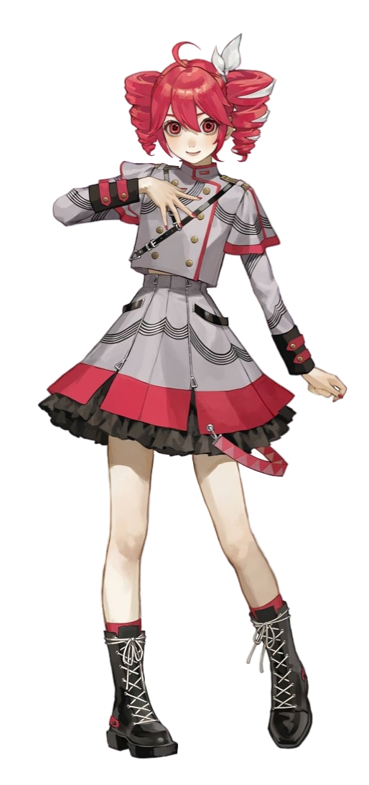

<h1 align="center">Hello, World 👋</h1>

###

  <!-- Teto on right -->
  
  
  <!-- Content on left -->
  

    <h3>👩‍💻 About Me</h3>
    
I'm Amirtaha Javadi  - 🔭 I’m studying CE at University. - 📚 I'm currently learning everything. - 👯 I’m looking to collaborate on Software Development.

    

      
    

     
    

      
      
    

  

 

###

<h3 align="center">🔥 My Stats</h3>

  

